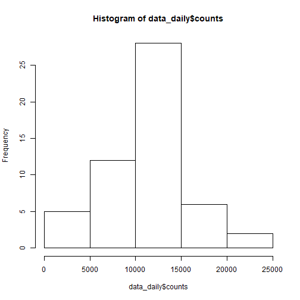
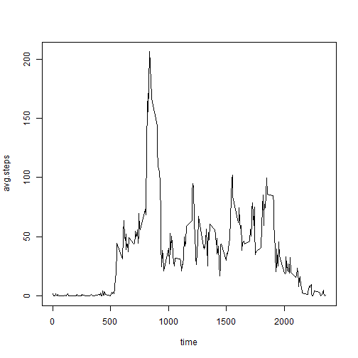
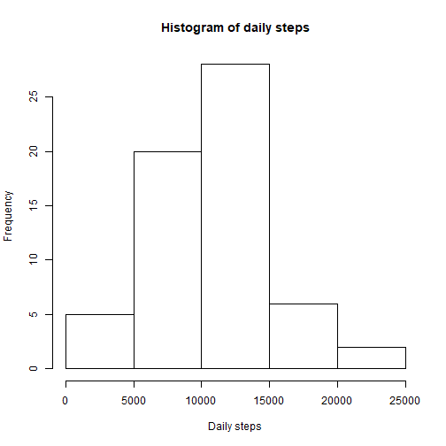
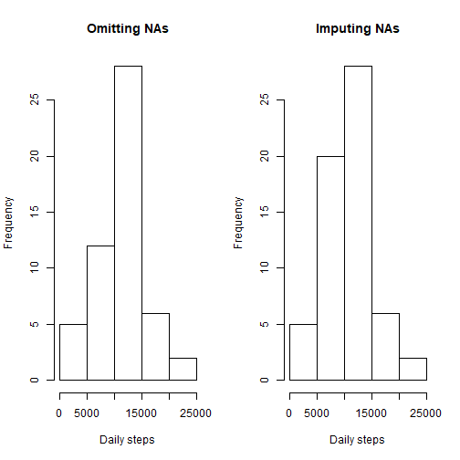
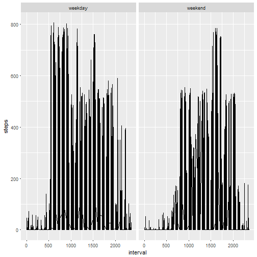

#Johns Hopkins University- Data Science Specialization

This is the first project in Reproducible Research in *Johns Hopkins University- Data Science Specialization*.The dataset in this project is downloaded from the github of the instructor, Roger D. Peng, readers can also download the dataset from [my github page](https://github.com/CaesarLWY/RepData_PeerAssessment1) where I had forked Roger's.  

The dataset is downloaded on 2018-02-28 23:01.

##1.Loading and preprocessing the data
###Load the data 


```r
setwd("C:/Users/c1992/Desktop/MOOCS-20170607T120517Z-001/MOOCS/JHU- Data Science/5- Reproducible Research")
data <- read.csv("./2_project_data_activity/activity.csv")
head(data)
```

```
##   steps       date interval
## 1    NA 2012-10-01        0
## 2    NA 2012-10-01        5
## 3    NA 2012-10-01       10
## 4    NA 2012-10-01       15
## 5    NA 2012-10-01       20
## 6    NA 2012-10-01       25
```

```r
dim(data)
```

```
## [1] 17568     3
```
There are 17568 rows(observations), but with only 3 variables.
Check the variable steps to count how many NAs in the data:


```r
sum(is.na(data$steps))
```

```
## [1] 2304
```

Apparently, there are 2304 NAs in the dataset, the observations with NA in steps variable should be eliminated for the purpose of further analysis.

###Process the data into a format suitable for the analysis

```r
tidydata <- data[-which(is.na(data$steps)),]
head(tidydata)
```

```
##     steps       date interval
## 289     0 2012-10-02        0
## 290     0 2012-10-02        5
## 291     0 2012-10-02       10
## 292     0 2012-10-02       15
## 293     0 2012-10-02       20
## 294     0 2012-10-02       25
```

```r
tail(tidydata)
```

```
##       steps       date interval
## 17275     0 2012-11-29     2330
## 17276     0 2012-11-29     2335
## 17277     0 2012-11-29     2340
## 17278     0 2012-11-29     2345
## 17279     0 2012-11-29     2350
## 17280     0 2012-11-29     2355
```

```r
sum(is.na(tidydata$steps))
```

```
## [1] 0
```

##2.What is mean total number of steps taken per day?

###Calculate the total number of steps taken per day.


```r
data_daily <- aggregate(list(tidydata$steps), by= list(tidydata$date), FUN = sum)
names(data_daily) <- c("Date","counts")
head(data_daily)
```

```
##         Date counts
## 1 2012-10-02    126
## 2 2012-10-03  11352
## 3 2012-10-04  12116
## 4 2012-10-05  13294
## 5 2012-10-06  15420
## 6 2012-10-07  11015
```

###Make a histogram of the total number of steps taken each day.


```r
hist(data_daily$counts)
```



###Calculate and report the mean and median of the total number of steps taken per day.


```r
data_daily_mean <- aggregate(list(tidydata$steps), by= list(tidydata$date), FUN= mean)
names(data_daily_mean) <- c("date","mean") 
data_daily_mean
```

```
##          date       mean
## 1  2012-10-02  0.4375000
## 2  2012-10-03 39.4166667
## 3  2012-10-04 42.0694444
## 4  2012-10-05 46.1597222
## 5  2012-10-06 53.5416667
## 6  2012-10-07 38.2465278
## 7  2012-10-09 44.4826389
## 8  2012-10-10 34.3750000
## 9  2012-10-11 35.7777778
## 10 2012-10-12 60.3541667
## 11 2012-10-13 43.1458333
## 12 2012-10-14 52.4236111
## 13 2012-10-15 35.2048611
## 14 2012-10-16 52.3750000
## 15 2012-10-17 46.7083333
## 16 2012-10-18 34.9166667
## 17 2012-10-19 41.0729167
## 18 2012-10-20 36.0937500
## 19 2012-10-21 30.6284722
## 20 2012-10-22 46.7361111
## 21 2012-10-23 30.9652778
## 22 2012-10-24 29.0104167
## 23 2012-10-25  8.6527778
## 24 2012-10-26 23.5347222
## 25 2012-10-27 35.1354167
## 26 2012-10-28 39.7847222
## 27 2012-10-29 17.4236111
## 28 2012-10-30 34.0937500
## 29 2012-10-31 53.5208333
## 30 2012-11-02 36.8055556
## 31 2012-11-03 36.7048611
## 32 2012-11-05 36.2465278
## 33 2012-11-06 28.9375000
## 34 2012-11-07 44.7326389
## 35 2012-11-08 11.1770833
## 36 2012-11-11 43.7777778
## 37 2012-11-12 37.3784722
## 38 2012-11-13 25.4722222
## 39 2012-11-15  0.1423611
## 40 2012-11-16 18.8923611
## 41 2012-11-17 49.7881944
## 42 2012-11-18 52.4652778
## 43 2012-11-19 30.6979167
## 44 2012-11-20 15.5277778
## 45 2012-11-21 44.3993056
## 46 2012-11-22 70.9270833
## 47 2012-11-23 73.5902778
## 48 2012-11-24 50.2708333
## 49 2012-11-25 41.0902778
## 50 2012-11-26 38.7569444
## 51 2012-11-27 47.3819444
## 52 2012-11-28 35.3576389
## 53 2012-11-29 24.4687500
```

```r
data_daily_median <- aggregate(list(tidydata$steps), by= list(tidydata$date), FUN= median)
names(data_daily_median) <- c("date", "median")
data_daily_median
```

```
##          date median
## 1  2012-10-02      0
## 2  2012-10-03      0
## 3  2012-10-04      0
## 4  2012-10-05      0
## 5  2012-10-06      0
## 6  2012-10-07      0
## 7  2012-10-09      0
## 8  2012-10-10      0
## 9  2012-10-11      0
## 10 2012-10-12      0
## 11 2012-10-13      0
## 12 2012-10-14      0
## 13 2012-10-15      0
## 14 2012-10-16      0
## 15 2012-10-17      0
## 16 2012-10-18      0
## 17 2012-10-19      0
## 18 2012-10-20      0
## 19 2012-10-21      0
## 20 2012-10-22      0
## 21 2012-10-23      0
## 22 2012-10-24      0
## 23 2012-10-25      0
## 24 2012-10-26      0
## 25 2012-10-27      0
## 26 2012-10-28      0
## 27 2012-10-29      0
## 28 2012-10-30      0
## 29 2012-10-31      0
## 30 2012-11-02      0
## 31 2012-11-03      0
## 32 2012-11-05      0
## 33 2012-11-06      0
## 34 2012-11-07      0
## 35 2012-11-08      0
## 36 2012-11-11      0
## 37 2012-11-12      0
## 38 2012-11-13      0
## 39 2012-11-15      0
## 40 2012-11-16      0
## 41 2012-11-17      0
## 42 2012-11-18      0
## 43 2012-11-19      0
## 44 2012-11-20      0
## 45 2012-11-21      0
## 46 2012-11-22      0
## 47 2012-11-23      0
## 48 2012-11-24      0
## 49 2012-11-25      0
## 50 2012-11-26      0
## 51 2012-11-27      0
## 52 2012-11-28      0
## 53 2012-11-29      0
```

##3.What is the average daily activity pattern?

###Make a time series plot of the 5-minute interval (x-axis) and the average number of steps taken, averaged across all days (y-axis).

```r
avgdata <- aggregate(list(tidydata$steps), by= list(tidydata$interval), FUN= mean)
names(avgdata) <- c("time","avg.steps")
head(avgdata)
```

```
##   time avg.steps
## 1    0 1.7169811
## 2    5 0.3396226
## 3   10 0.1320755
## 4   15 0.1509434
## 5   20 0.0754717
## 6   25 2.0943396
```

```r
with(avgdata, plot(avg.steps~time, type="l"))
```



###Which 5-minute interval, on average across all the days in the dataset, contains the maximum number of steps?  
To find which time interval across all the days possess the maximum value, we can run the following code to achieve:


```r
avgdata[which.max(avgdata$avg.steps),]
```

```
##     time avg.steps
## 104  835  206.1698
```
We can observe that when time interval is 835, avg.steps reaches its peak on 206.1698.
 
##4.Imputing missing values
###Calculate and report the total number of missing values in the dataset.
As the analysis in part1.Reading and Processing data, there are 2304 NAs in the preliminary dataset.Instea of ommiting these observations, we can use another way to deal with these observations with NAs.

###Devise a strategy for filling in all of the missing values in the dataset. 

```r
library(impute)
date <- data[,2]
data.imputed <- impute.knn(as.matrix(data[,-2]))$data
```

```
## Cluster size 17568 broken into 8784 8784 
## Cluster size 8784 broken into 4445 4339 
## Cluster size 4445 broken into 2250 2195 
## Cluster size 2250 broken into 1111 1139 
## Done cluster 1111 
## Done cluster 1139 
## Done cluster 2250 
## Cluster size 2195 broken into 862 1333 
## Done cluster 862 
## Done cluster 1333 
## Done cluster 2195 
## Done cluster 4445 
## Cluster size 4339 broken into 2195 2144 
## Cluster size 2195 broken into 980 1215 
## Done cluster 980 
## Done cluster 1215 
## Done cluster 2195 
## Cluster size 2144 broken into 2044 100 
## Cluster size 2044 broken into 1174 870 
## Done cluster 1174 
## Done cluster 870 
## Done cluster 2044 
## Done cluster 100 
## Done cluster 2144 
## Done cluster 4339 
## Done cluster 8784 
## Cluster size 8784 broken into 4401 4383 
## Cluster size 4401 broken into 2275 2126 
## Cluster size 2275 broken into 2007 268 
## Cluster size 2007 broken into 845 1162 
## Done cluster 845 
## Done cluster 1162 
## Done cluster 2007 
## Done cluster 268 
## Done cluster 2275 
## Cluster size 2126 broken into 928 1198 
## Done cluster 928 
## Done cluster 1198 
## Done cluster 2126 
## Done cluster 4401 
## Cluster size 4383 broken into 2187 2196 
## Cluster size 2187 broken into 976 1211 
## Done cluster 976 
## Done cluster 1211 
## Done cluster 2187 
## Cluster size 2196 broken into 1220 976 
## Done cluster 1220 
## Done cluster 976 
## Done cluster 2196 
## Done cluster 4383 
## Done cluster 8784
```

```r
data.imputed <- as.data.frame(data.imputed)
sum(is.na(data.imputed$steps))
```

```
## [1] 0
```

```r
head(data.imputed)
```

```
##       steps interval
## 1 9.0000000        0
## 2 2.0000000        5
## 3 0.7777778       10
## 4 0.8888889       15
## 5 0.0000000       20
## 6 1.4444444       25
```

```r
tail(data.imputed)
```

```
##           steps interval
## 17563 0.0000000     2330
## 17564 0.0000000     2335
## 17565 0.0000000     2340
## 17566 0.8888889     2345
## 17567 0.8888889     2350
## 17568 2.2222222     2355
```

In the previous code chunk, *k-nearest neighbor* is adopted to impute the missing values, and by the result of sum(is.na(data.imputed$steps))==0, we can easily observe the NAs in the steps variable had fallen from 2304 to 0.

###Create a new dataset that is equal to the original dataset but with the missing data filled in.

```r
data.imputed <- cbind(data.imputed, date)
head(data.imputed)
```

```
##       steps interval       date
## 1 9.0000000        0 2012-10-01
## 2 2.0000000        5 2012-10-01
## 3 0.7777778       10 2012-10-01
## 4 0.8888889       15 2012-10-01
## 5 0.0000000       20 2012-10-01
## 6 1.4444444       25 2012-10-01
```

```r
tail(data.imputed)
```

```
##           steps interval       date
## 17563 0.0000000     2330 2012-11-30
## 17564 0.0000000     2335 2012-11-30
## 17565 0.0000000     2340 2012-11-30
## 17566 0.8888889     2345 2012-11-30
## 17567 0.8888889     2350 2012-11-30
## 17568 2.2222222     2355 2012-11-30
```

Now we have the complete data table being similar with the original one, except plugging into simulated values to replace NAs.

###Make a histogram of the total number of steps taken each day and Calculate and report the mean and median total number of steps taken per day.Do these values differ from the estimates from the first part of the project? What is the impact of imputing missing data on the estimates of the total daily number of steps? 

```r
data.imputed_count <- aggregate(list(data.imputed$steps), by= list(data.imputed$date), FUN= sum)
names(data.imputed_count) <- c("date", "counts")
head(data.imputed_count)
```

```
##         date counts
## 1 2012-10-01   5923
## 2 2012-10-02    126
## 3 2012-10-03  11352
## 4 2012-10-04  12116
## 5 2012-10-05  13294
## 6 2012-10-06  15420
```

```r
hist(data.imputed_count$counts, xlab= "Daily steps", main= "Histogram of daily steps")
```



Then calculate the mean value and median value of daily steps without NAs.


```r
data.imputed_mean <- aggregate(list(data.imputed$steps), by= list(data.imputed$date), FUN= mean)
names(data.imputed_mean) <- c("date","mean")
data.imputed_mean
```

```
##          date       mean
## 1  2012-10-01 20.5659722
## 2  2012-10-02  0.4375000
## 3  2012-10-03 39.4166667
## 4  2012-10-04 42.0694444
## 5  2012-10-05 46.1597222
## 6  2012-10-06 53.5416667
## 7  2012-10-07 38.2465278
## 8  2012-10-08 20.5659722
## 9  2012-10-09 44.4826389
## 10 2012-10-10 34.3750000
## 11 2012-10-11 35.7777778
## 12 2012-10-12 60.3541667
## 13 2012-10-13 43.1458333
## 14 2012-10-14 52.4236111
## 15 2012-10-15 35.2048611
## 16 2012-10-16 52.3750000
## 17 2012-10-17 46.7083333
## 18 2012-10-18 34.9166667
## 19 2012-10-19 41.0729167
## 20 2012-10-20 36.0937500
## 21 2012-10-21 30.6284722
## 22 2012-10-22 46.7361111
## 23 2012-10-23 30.9652778
## 24 2012-10-24 29.0104167
## 25 2012-10-25  8.6527778
## 26 2012-10-26 23.5347222
## 27 2012-10-27 35.1354167
## 28 2012-10-28 39.7847222
## 29 2012-10-29 17.4236111
## 30 2012-10-30 34.0937500
## 31 2012-10-31 53.5208333
## 32 2012-11-01 20.5659722
## 33 2012-11-02 36.8055556
## 34 2012-11-03 36.7048611
## 35 2012-11-04 20.5659722
## 36 2012-11-05 36.2465278
## 37 2012-11-06 28.9375000
## 38 2012-11-07 44.7326389
## 39 2012-11-08 11.1770833
## 40 2012-11-09 20.5659722
## 41 2012-11-10 20.5659722
## 42 2012-11-11 43.7777778
## 43 2012-11-12 37.3784722
## 44 2012-11-13 25.4722222
## 45 2012-11-14 20.5659722
## 46 2012-11-15  0.1423611
## 47 2012-11-16 18.8923611
## 48 2012-11-17 49.7881944
## 49 2012-11-18 52.4652778
## 50 2012-11-19 30.6979167
## 51 2012-11-20 15.5277778
## 52 2012-11-21 44.3993056
## 53 2012-11-22 70.9270833
## 54 2012-11-23 73.5902778
## 55 2012-11-24 50.2708333
## 56 2012-11-25 41.0902778
## 57 2012-11-26 38.7569444
## 58 2012-11-27 47.3819444
## 59 2012-11-28 35.3576389
## 60 2012-11-29 24.4687500
## 61 2012-11-30 20.5659722
```

```r
data.imputed_median <- aggregate(list(data.imputed$steps), by= list(data.imputed$date), FUN= median)
names(data.imputed_median) <- c("date","median")
data.imputed_median
```

```
##          date   median
## 1  2012-10-01 8.944444
## 2  2012-10-02 0.000000
## 3  2012-10-03 0.000000
## 4  2012-10-04 0.000000
## 5  2012-10-05 0.000000
## 6  2012-10-06 0.000000
## 7  2012-10-07 0.000000
## 8  2012-10-08 8.944444
## 9  2012-10-09 0.000000
## 10 2012-10-10 0.000000
## 11 2012-10-11 0.000000
## 12 2012-10-12 0.000000
## 13 2012-10-13 0.000000
## 14 2012-10-14 0.000000
## 15 2012-10-15 0.000000
## 16 2012-10-16 0.000000
## 17 2012-10-17 0.000000
## 18 2012-10-18 0.000000
## 19 2012-10-19 0.000000
## 20 2012-10-20 0.000000
## 21 2012-10-21 0.000000
## 22 2012-10-22 0.000000
## 23 2012-10-23 0.000000
## 24 2012-10-24 0.000000
## 25 2012-10-25 0.000000
## 26 2012-10-26 0.000000
## 27 2012-10-27 0.000000
## 28 2012-10-28 0.000000
## 29 2012-10-29 0.000000
## 30 2012-10-30 0.000000
## 31 2012-10-31 0.000000
## 32 2012-11-01 8.944444
## 33 2012-11-02 0.000000
## 34 2012-11-03 0.000000
## 35 2012-11-04 8.944444
## 36 2012-11-05 0.000000
## 37 2012-11-06 0.000000
## 38 2012-11-07 0.000000
## 39 2012-11-08 0.000000
## 40 2012-11-09 8.944444
## 41 2012-11-10 8.944444
## 42 2012-11-11 0.000000
## 43 2012-11-12 0.000000
## 44 2012-11-13 0.000000
## 45 2012-11-14 8.944444
## 46 2012-11-15 0.000000
## 47 2012-11-16 0.000000
## 48 2012-11-17 0.000000
## 49 2012-11-18 0.000000
## 50 2012-11-19 0.000000
## 51 2012-11-20 0.000000
## 52 2012-11-21 0.000000
## 53 2012-11-22 0.000000
## 54 2012-11-23 0.000000
## 55 2012-11-24 0.000000
## 56 2012-11-25 0.000000
## 57 2012-11-26 0.000000
## 58 2012-11-27 0.000000
## 59 2012-11-28 0.000000
## 60 2012-11-29 0.000000
## 61 2012-11-30 8.944444
```

Compare the result of dataset omitting NAs with dataset imputing NAs. We draw the daily steps histogram out to compare here.


```r
par(mfrow= c(1,2))
hist(data_daily$counts, xlab= "Daily steps", main= "Omitting NAs")
hist(data.imputed_count$counts, xlab= "Daily steps", main= "Imputing NAs")
```


In the previous plots, we can observe that the frequency of daily steps increases from 12 to 20 in the interval(5000,10000).There are also some changes in median and mean of daily steps, including 0s in the median tables decreses,...etc.

##5.Are there differences in activity patterns between weekdays and weekends?

###Create a new factor variable in the dataset with two levels ¡V ¡§weekday¡¨ and ¡§weekend¡¨ indicating whether a given date is a weekday or weekend day.


```r
Sys.setlocale("LC_TIME","English")
```

```
## [1] "English_United States.1252"
```

```r
data.imputed$weekdays <-
weekdays(as.POSIXct(data.imputed$date))
head(data.imputed)
```

```
##       steps interval       date weekdays
## 1 9.0000000        0 2012-10-01   Monday
## 2 2.0000000        5 2012-10-01   Monday
## 3 0.7777778       10 2012-10-01   Monday
## 4 0.8888889       15 2012-10-01   Monday
## 5 0.0000000       20 2012-10-01   Monday
## 6 1.4444444       25 2012-10-01   Monday
```

```r
tail(data.imputed)
```

```
##           steps interval       date weekdays
## 17563 0.0000000     2330 2012-11-30   Friday
## 17564 0.0000000     2335 2012-11-30   Friday
## 17565 0.0000000     2340 2012-11-30   Friday
## 17566 0.8888889     2345 2012-11-30   Friday
## 17567 0.8888889     2350 2012-11-30   Friday
## 17568 2.2222222     2355 2012-11-30   Friday
```


```r
class(data.imputed$weekdays)
```

```
## [1] "character"
```

```r
data.imputed$weekdays <- as.factor(data.imputed$weekdays)
levels(data.imputed$weekdays)
```

```
## [1] "Friday"    "Monday"    "Saturday"  "Sunday"    "Thursday"  "Tuesday"  
## [7] "Wednesday"
```

```r
levels(data.imputed$weekdays)[levels(data.imputed$weekdays)==c("Saturday","Sunday")] <- "weekend"
```

```
## Warning in levels(data.imputed$weekdays) == c("Saturday", "Sunday"): longer
## object length is not a multiple of shorter object length
```

```r
levels(data.imputed$weekdays)
```

```
## [1] "Friday"    "Monday"    "weekend"   "Thursday"  "Tuesday"   "Wednesday"
```

```r
levels(data.imputed$weekdays)[levels(data.imputed$weekdays)!="weekend"] <- "weekday"
levels(data.imputed$weekdays)
```

```
## [1] "weekday" "weekend"
```

###Make a panel plot containing a time series plot of the 5-minute interval (x-axis) and the average number of steps taken, averaged across all weekday days or weekend days (y-axis). 


```r
library(ggplot2)
g <- ggplot(data.imputed, aes(interval, steps))
g + geom_line()+ facet_grid(.~weekdays) 
```




